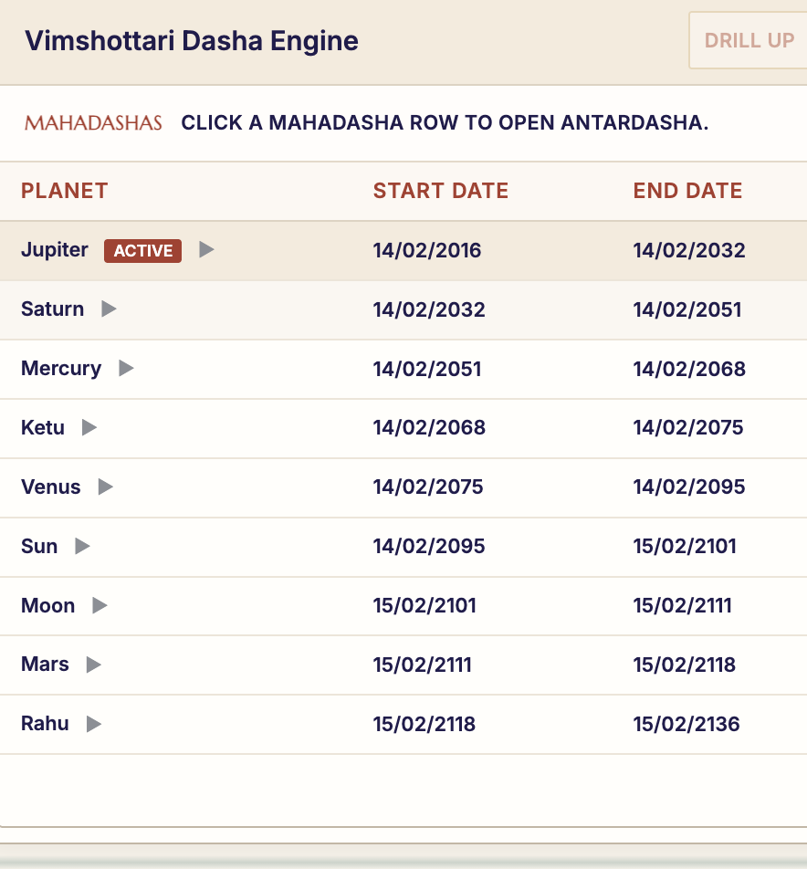

  

  <h1>Shree Lakshmi Astro</h1>

  

    A production Vedic astrology platform for meaningful guidance, accurate chart intelligence,
    verified astrologer workflows, and a dedicated learning community for practitioners.
  

  

    <a href="https://www.shreelakshmiastro.com"><strong>Visit the live website</strong></a>
  

## Purpose

Shree Lakshmi Astro was made to bring traditional Vedic astrology into a professional digital experience. Many astrology journeys still depend on scattered messages, manual chart preparation, repeated explanations, and disconnected follow-ups. This platform brings those pieces together so users can ask important life questions, receive structured astrological context, and connect with trusted practitioners in a smoother way.

The product is built for real-world use. It focuses on clarity, trust, cultural depth, and practical access to astrology without making the experience feel confusing or overwhelming.

## What It Offers

- Prashna and Lagna chart generation using precise astronomical calculations.
- Planetary positions, rashis, nakshatras, padas, divisional chart context, and Vimshottari dasha insights.
- AI-assisted interpretation layered on top of deterministic astrology calculations.
- Consultant discovery and guided consultation workflows.
- Verified astrologer and admin workspaces for managing professional activity.
- Real-time community features for discussion, collaboration, and knowledge sharing.
- A responsive public website designed around the Shree Lakshmi Astro brand.

## Product Proof

Shree Lakshmi Astro is not just a concept or landing page. The platform includes working astrology tools, generated chart views, and dasha timelines designed for real interpretation workflows.

  
  
<strong>D1 Rashi / Lagna chart output</strong>

  
  
<strong>Vimshottari Dasha engine with Mahadasha timeline</strong>

## Astrologer Community

One of the key goals of Shree Lakshmi Astro is to create a serious community for astrologers.

The community is designed as a space where verified practitioners can learn, discuss, ask questions, compare techniques, and grow together. Astrologers can explore classical systems, chart interpretation, prediction methods, case discussions, research notes, and practical consultation experience in one focused environment.

It is not just a chat area. It is intended to become a professional learning circle for astrology practitioners, where knowledge can be shared respectfully and real practice can improve through discussion.

## How It Is Made

Shree Lakshmi Astro is powered by a Python FastAPI backend and a browser-first frontend experience.

The backend manages astrology calculations, chart interpretation, user-aware APIs, consultation workflows, admin operations, and real-time communication. The calculation layer uses Swiss Ephemeris data with timezone-aware location handling, allowing chart outputs to be based on accurate astronomical inputs.

The frontend combines public website pages with React-powered workspace screens. The public experience focuses on users and consultations, while the authenticated workspace supports community, admin, and practitioner-facing flows.

Supabase is used for identity, database storage, and protected user flows. Real-time communication is handled through WebSocket channels served by the FastAPI application.

## Technology

| Area | Stack |
| --- | --- |
| Backend | Python, FastAPI, Uvicorn, Pydantic |
| Astrology Calculations | Swiss Ephemeris, PySwissEph, TimezoneFinder |
| Frontend | HTML, CSS, JavaScript, React, Vite, TypeScript |
| Data & Identity | Supabase Postgres, Supabase Auth, Supabase Storage |
| Realtime | FastAPI WebSockets |
| AI Layer | Provider-backed interpretation services |

## Contributing

Contributions are welcome. If you are interested in improving the product, fixing issues, strengthening the astrology engine, enhancing the user experience, or expanding the astrologer community features, you are welcome to contribute.

Please keep contributions aligned with the product's purpose: a professional, respectful, and reliable astrology platform for users and practitioners.

## Website

[https://www.shreelakshmiastro.com](https://www.shreelakshmiastro.com)
